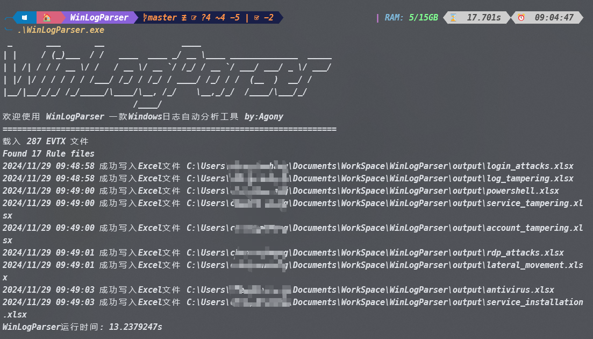
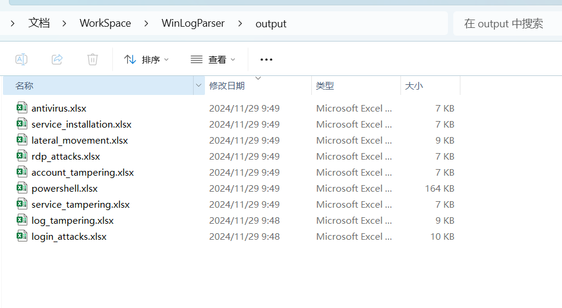

# WinLogParser - 一款Windows日志分析工具

## 介绍

基于Golang实现的一款本地分析EVTX日志的工具，无需管理员权限和联网，支持自定义规则来进行识别，双击执行后写入Excel文件。

## 


## 使用

使用示例，当前目录下创建一个 evtx 文件夹，将你需要分析的日志文件放入该文件夹中，确保 rules规则文件夹也存在（可以自定义也可以使用默认的），最后双击执行`WinLogParser.exe`文件，执行结果将输出到output目录下





如果你想快速体验，可以 clone 这个日志样本仓库到EVTX文件夹中，如何执行EXE

```
cd evtx
git clone https://github.com/sbousseaden/EVTX-ATTACK-SAMPLES.git
```


## 注意

开发环境：

- Go 1.20.1
- Windows 11

规则库来源于项目：https://github.com/WithSecureLabs/chainsaw 